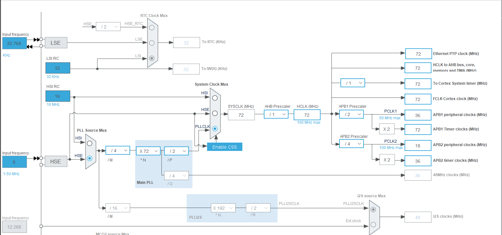

## 타이머에 대하여
- Hz라는건 HIGH와 LOW가 합쳐진 것을 의미 그래서 HIGH와 LOW를 한번 합쳐서 진행을한걸 1Hz라고 한다 다른말로 주파수
- 보통 아날로그는 한 사이클이라고 안에서


```c
void HAL_SYSTICK_Callback(void)
{
	if((timer_count%1000)==0)
	{
		printf("\n\r 1000ms interation");
		HAL_GPIO_TogglePin(GPIOC, GPIO_PIN_0);
	}
	timer_count++;
}

int main(void)
{
  /* Reset of all peripherals, Initializes the Flash interface and the Systick. */
  HAL_Init();

  /* Configure the system clock */
  SystemClock_Config();

  /* Initialize all configured peripherals */
  MX_GPIO_Init();
  MX_USART2_UART_Init();

  /* Infinite loop */
  /* USER CODE BEGIN WHILE */
  while (1)
  {
    /* USER CODE END WHILE */

    /* USER CODE BEGIN 3 */
  }
  /* USER CODE END 3 */
}
```
	→ 타이머가 동작이 되면 IRQ가 호출되기전에 HAL_SYSTICK_Callback 해당 이 함수가 실행이 된다.


# 📌 STM32 Timer 설정 방법 기초부터~
 - 1. 해당 STM32툴에 ioc에 가면 System Core가 있는데 
 - 2. 거기에 있는 NVIC로 들어가서 
 - 3. 해당 밑에 NVIC를 보면 Time base: System tick timer이 있다 거기서
 - 4. sub Priority 부분에 0에서 1로 바꾼다 이게 뭐냐면
	- 똑같은 인터럽트 신호가 계속해서 받아야하는데 지금 Preemption Priority에서 보면 지금 지금 0이라는 값들이 다 우선순위를 정하는거다
	- 어?? 근데 그러면 다 우선순위가 똑같으면 비교를 해야하잖아? 그치? 그래서 시스템에서 내부적으로 비교를 하는데 이걸 주 인터럽트라고 한다 여기서 비교를 못하면 부 인터럽트로 넘어가는데 그게 그 오른쪽에있는 Sub Prioity이다 여기서 우선순위를 정하는건데 1로 하는 이유는 이 타이머를 두번째로 하기 위해서이다. 

- 쉽게 이야기해서
```
ioc -> System Core -> NVIC -> Time base: System tick timer -> Preemption Priority -> Sub Prioity 1로 변환
```

```c
void HAL_TIM_PeriodElapsedCallback(TIM_HandleTypeDef* htim)
{
	printf("\n\r TIM1=> 1000ms interation!!");
	HAL_GPIO_TogglePin(GPIOC, LED_Pin);
}

int main(void)
{
  /* USER CODE BEGIN 1 */
	float volt = 0.0;
  /* USER CODE END 1 */
  HAL_Init();

  /* Configure the system clock */
  SystemClock_Config();

  /* Initialize all configured peripherals */
  MX_GPIO_Init();
  MX_USART2_UART_Init();
  MX_TIM1_Init();
  /* USER CODE BEGIN 2 */
  HAL_TIM_Base_Start_IT(&htim1);
  printf("\n TIM1 test start!");
  /* USER CODE END 2 */

  /* Infinite loop */
  /* USER CODE BEGIN WHILE */
  while (1)
  {
    /* USER CODE END WHILE */
    /* USER CODE BEGIN 3 */
  }
  /* USER CODE END 3 */
}
```

```c
HAL_TIM_Base_Start_IT(&htim1);
```
- 이건 타이머가 시작을 한다는걸 의미한다. 
- 역시나 타이머가 시작이되고 타이머가 동작한다는걸 알면 그 때서야 HAL_TIM_PeriodElapsedCallback 이게 호출이 된다.

📌 이제 Hz관련되서 설명을 할 생각이다.
```
● ioc에 가보면 왼쪽에 있는 나열되어있는 말고 그 위에 Pinout & Configuration이랑 Clock Configuration이랑 Project Manager이랑 Tools가 있다 위에 4개가 있는데

● 그 위에있는 Clock Configuration여기에 들어가면 설정을 해줘야하는데 차근차근 설명을 하겠다.

1. 일단 가운데 보면 SYSCLK(MHz)가 있는데 여기서 72로 바꿔야한다 그 오른쪽에 AHB Prescaler는 1로 그 오른쪽에 있는 HCLK(MHz)이걸 72로 변환
2. 그 오른쪽에 있는 ARB1 Prescaler를 2로 그리고 APB1 Peripheral clocks (MHz)을 36으로 그 밑에있는걸 72로 바꾼다
3. APB2 Peripheral clocks (MHz) 이것도 18 그리고 그 밑에있는 것도 36로 바꾼다
```

```
그리고 TIM1을 사용을 할건데 TIM1에 들어가서 
```



```
Timers에 들어가서 보면 TIM1에 들어가서 Clock Source를 Internal Clock으로 바꾼다 그리고 그 Configuration밑에 가면 NVIC Settings에 가면 
TIM1 Break interrupt and TIM9 global interrupt에 에 체크를 하고 Sub Priority에 1로 설정 그리고 그밑에 있는

TIM1 update interrupt and TIM10 global interrupt에 있는 Sub Priority를 2로 설정을 해준다
```